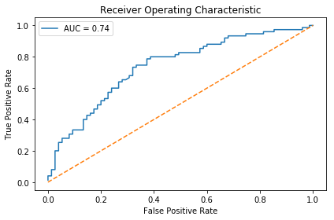

# Predicting Bee Species with Images

### Can a machine identify a bee as a honey bee or a bumble bee? These bees have different behaviors and appearances, but given the variety of backgrounds, positions, and image resolutions, it can be a challenge for machines to tell them apart.

<em>A honey bee (Apis).</em>

<em>A bumble bee (Bombus).</em>

Identifying different species of bees in the wild means that we can better understand the prevalence and growth of these important insects

Being able to identify bee species from images is a task that ultimately would allow researchers to more quickly and effectively collect field data. Pollinating bees have critical roles in both ecology and agriculture, and diseases like colony collapse disorder threaten these species.

In this project i will predict the bee specie with a supervised learning model.

### Libraries used:

- Matplotlib
- IPython
- Pandas
- Numpy
- PIL
- Skimage
- Sklearn

### Conclusion:

I used the Datacamp IDE because my computer have a problem to import Skimage library. (dont know why) 

Using the Support Vector Machine (SVM) model with a StandarScaler and PCA metods at my data i can get 68% of accuracy.

So i decide to use ROC curve + AUC

The [receiver operating characteristic curve](https://en.wikipedia.org/wiki/Receiver_operating_characteristic) (ROC curve) plots the false positive rate and true positive rate at different thresholds. ROC curves are judged visually by how close they are to the upper lefthand corner.

The [area under the curve](https://en.wikipedia.org/wiki/Receiver_operating_characteristic#Area_under_the_curve) (AUC) is also calculated, where 1 means every predicted label was correct. Generally, the worst score for AUC is 0.5, which is the performance of a model that randomly guesses.

<em>AUC Graph.</em>
